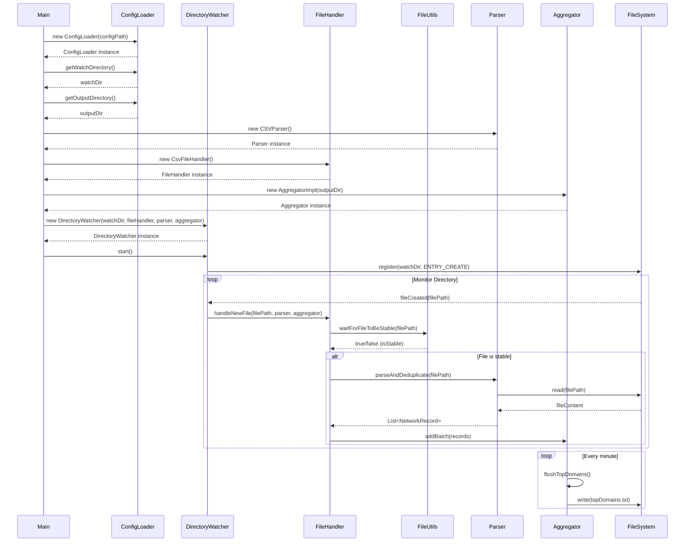

# network-analyzer
A Java application that monitors a directory for CSV files containing network connection records, parses them, and periodically generates reports of the top 10 most frequently accessed domains.

## Architecture
The application follows a layered architecture with clear separation of concerns:
### Components
- **Main**: Entry point that initializes all components
- **ConfigLoader**: Loads configuration from properties file
- **DirectoryWatcher**: Monitors a directory for new CSV files
- **FileHandler**: Handles new files and coordinates parsing and aggregation
- **Parser**: Parses CSV files into NetworkRecord objects
- **Aggregator**: Aggregates records and periodically generates reports
- **FileUtils**: Utility for checking file stability

## Prerequisites
- Java 17 or later

## Features 
- Directory Monitoring: Continuously watches a specified directory for new files added by an external system or utility.
- File Stability Handling: Waits until each incoming file is fully copied before processing to avoid partial reads.
- CSV Parsing: Processes files containing structured records of network connections
- Avoid Deduplication
- Aggregation Logic: Every minute, aggregates all valid records and computes the top 10 most frequently reported domains based on connection count.
- Output Reporting: Writes the list of top domains along with their connection counts to a .txt file, updating it at regular 1-minute intervals.

## Configuration

The application requires a configuration file at `config/config.properties` with the following properties:

- `watch.directory`: Directory to monitor for new CSV files
- `output.directory`: Directory where to write the output files with top domains

## CSV Format

The application expects CSV files with the following format:

```
timestamp,source_ip,source_port,destination_ip,destination_port,domain
```

Example:
```
1708867200000,192.168.1.10,5000,10.0.0.5,53,example.com
```

## Basic commands to run the application from the root folder
1. Compile the soruce code
   ```
   javac -d out -sourcepath src src/com/sc/network_analyzer/Main.java
   ```

3. Run the Application
   ```
   - java -cp out com.sc.network_analyzer.Main
     ```


## Sequence Diagram

