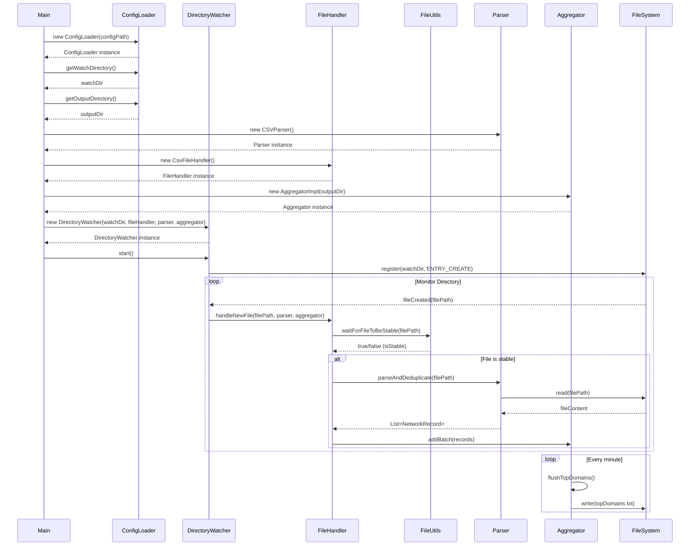

# network-analyzer
This Java application is designed to monitor a configurable directory for newly added CSV files, extract network connection data, and continuously analyze the most accessed domains in near real-time.

## Prerequisites
- Java 17 or later

## Features 
- Directory Monitoring: Continuously watches a specified directory for new files added by an external system or utility.
- File Stability Handling: Waits until each incoming file is fully copied before processing to avoid partial reads.
- CSV Parsing: Processes files containing structured records of network connections
- Avoid Deduplication
- Aggregation Logic: Every minute, aggregates all valid records and computes the top 10 most frequently reported domains based on connection count.
- Output Reporting: Writes the list of top domains along with their connection counts to a .txt file, updating it at regular 1-minute intervals.

## Sequence Diagram

